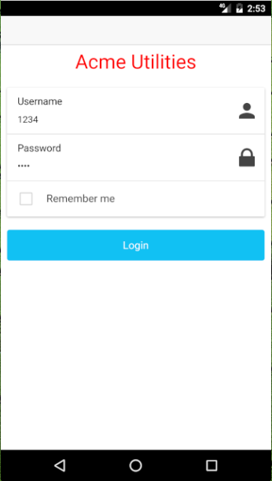
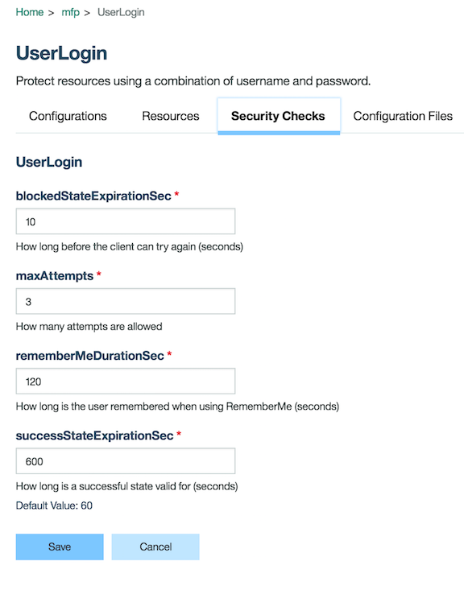

# Introduction

Imagine that you are a utilities company that has engineers working in the field. You have equipped these engineers with mobile devices, and now you are interested in building an app that will help your engineers perform their job more effieciently. 

In this lab we will cover a five modules to help you learn how to build an app for your employees with IBM MobileFirst Foundation, and how to tie in IBM Bluemix Services to enhance it.

1. [Adapters]()
2. [Security]()
3. [Watson Speech to Text]()
4. [Analytics]()

For those that are interested in skipping the modules and just seeing the app running right away, please take a look at our [Quick Start Guide]().

## Watson Speech to Text Service 

Currently, a lot of enigeers have to write down serial numbers, model number, etc. whenever they service an equipment in the field. 
To make it easy for our engineers to record these details, we want to enable them to say them out loud to record them in the app, instead of typing all the details. For this functionality, we used the [Watson speech to text](https://console.ng.bluemix.net/catalog/services/speech-to-text/) Bluemix service in our MobileFirst Foundation app. You'll see how to integrate this service into your app in this part of the lab.

## Security
When you go about this project, one of the key considerations you’ll likely encounter is how to protect your enterprise APIs from hackers or from access from unsanctioned users, apps, or devices. To do this, you’ll have to make sure clients calling your APIs are authenticated, and have the required permissions to access these APIs. 

The MobileFirst Security framework provides the infrastructure that makes it very easy to implement the authentication & authorization logic to protect your APIs when they are accessed from mobile apps, and enforce it at runtime. And the security framework implements the OAuth2 protocol, which apart from being the industry standard protocol to protect APIs, also makes it easy to leverage additional security products in your infrastructure.

### Login
In this demo app you’ll see a login see a log-in screen where the engineer will have to enter a valid username and password to view current work items assigned to the engineer.

In the [Security Lab](https://github.ibm.com/cord-americas/), you will see how Foundation simplifies the development of this security behavior (and many other types) so that your development team doesn’t have to go learn OAUTH2, or become security experts, and can also reuse security logic to protect different APIs or in different apps.

In the guide you’ll see that there are server side and client side building blocks called security checks and challenge handlers respectfully. 

- The security checks are server side entities that implement the server side security logic for protecting your APIs. For example issuing a request to the client to supply user name & password credentials, and receiving and validating the credentials against a user registry.
- The challenge handler is a client side entity that implements the security logic to, in this case, acquire the users credentials when prompted by the server.

The Security Framework provides classes that already implement most of the technical aspects of the security behavior, so that your developers only have to focus on developing the UI and any custom logic. MobileFirst also takes care of activating the security logic at runtime. After the user successfully passes the requires security checks (or tests), in this case supplying a valid user name & password, the Security Frameworks takes care of the the client-server communication that goes on that ultimately results in the client acquiring an access token for the API.

Furthermore, you’ll see how you can easily specify what security checks are required for access to any given API from the MobileFirst Foundation Console. And how it is possible to change security configurations directly from the console, such as the number of attempts a user gets, or the time before a successful log-in expires, that take effect immediately.

After the engineer logs in, the engineer will be able to access the protected resources as long as that token has not expired. So if you set this token to 60 seconds, the engineer will automatically be logged out after 60 seconds. 

## Conclusion
In this demo, we successfully create a hybrid Ionic MobileFirst Foundation 8.0 app that has protected endpoints with Watson integration.
