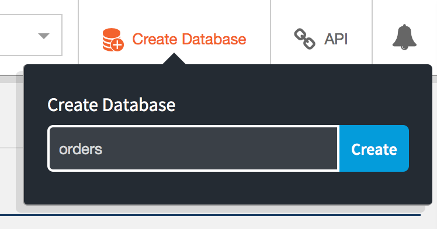
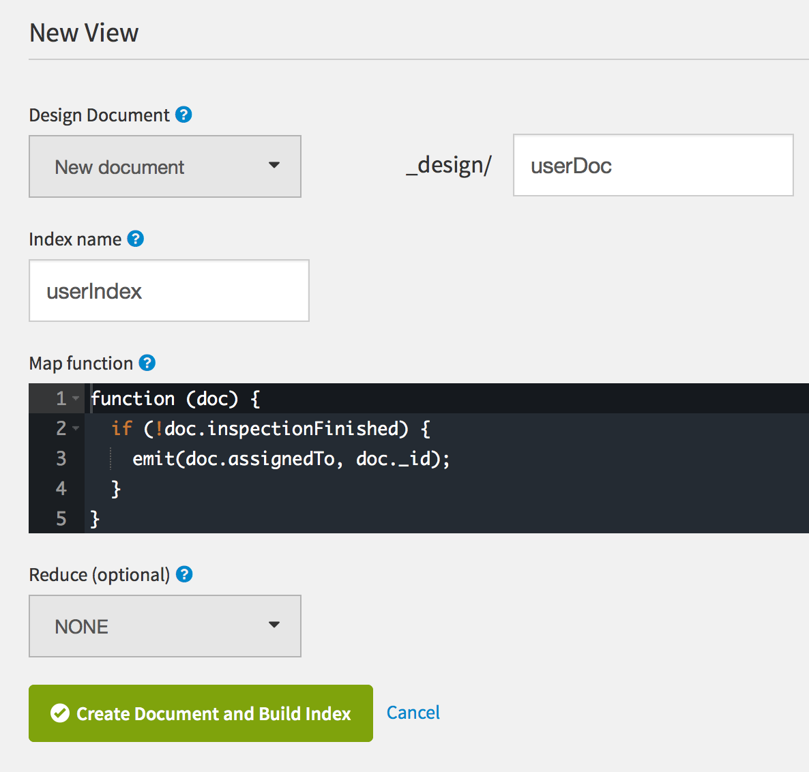
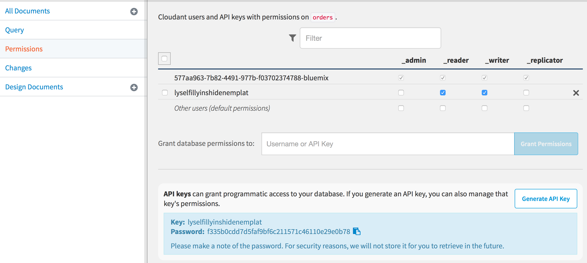
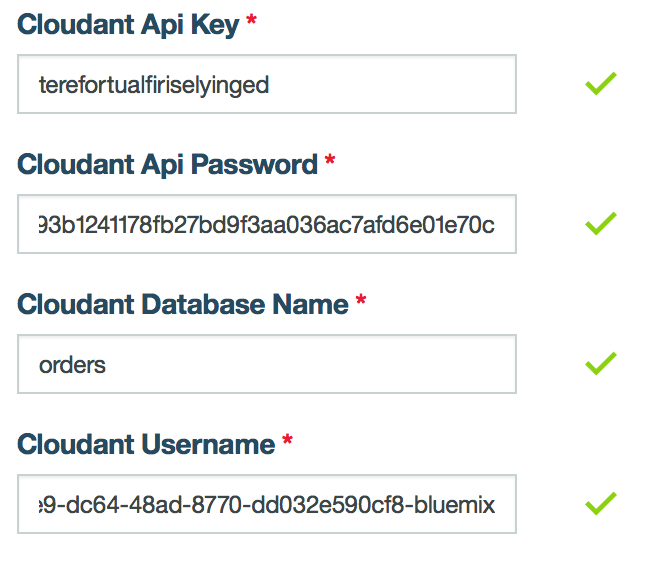
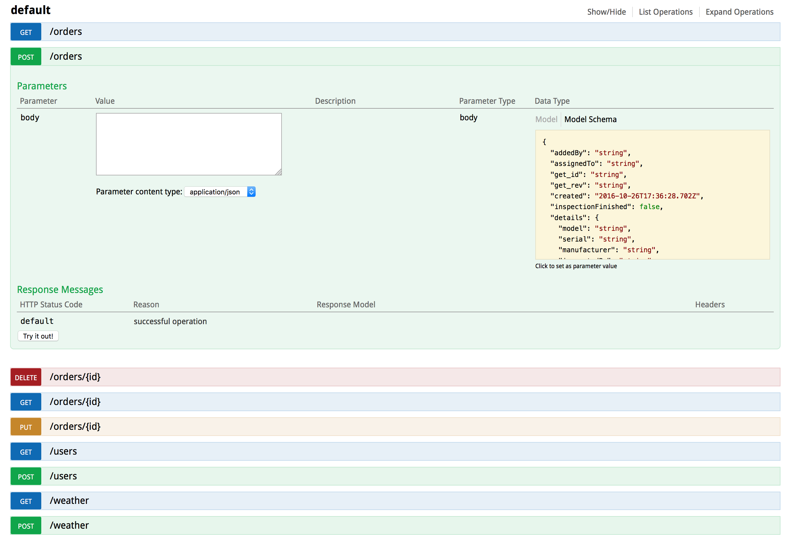

# Creating a Cloudant Adapter

The Utilities Demo application uses a custom adapter to store and retrieve information from a Cloudant database sitting on Bluemix.

Before getting started it's important to know how to create and work with adapters in MobileFirst. The recommended steps are to read the documentation for an [overview on adapters](https://mobilefirstplatform.ibmcloud.com/tutorials/en/foundation/8.0/adapters/) and the more specific information on [creating an adapter in java](https://mobilefirstplatform.ibmcloud.com/tutorials/en/foundation/8.0/adapters/creating-adapters/).

## Adding the Cloudant Code

### Designing the Document

After following the above links and creating an adapter shell, the next step is to decide the structure of the documents that will be stored in Cloudant. Since Cloudant is a NoSQL database each record stored there is saved as a JSON document. For this app each document should include both the background information for the work order as well as the resulting information from the inspection.

Here is the final design of the document:

```json
{
  "_id": "303012250",
  "_rev": "10-3e60aeee4f58b3da87ee77c889c86fb4",
  "addedBy": "Cosmo Kramer",
  "assignedTo": "George Costanza",
  "location": "Durham, NC",
  "created": "Aug 11, 2016 1:47:59 PM",
  "inspectionFinished": true,
  "details": 
  {
    "model": "Dishwasher 1",
    "serial": "123ABC",
    "manufacturer": "Sears",
    "inspectedBy": "George Costanza",
    "failReason": "Some reason here.",
    "fileName": "Sears-dishwasher1",
    "notes": "Notes go here.",
    "manufactureYear": 2016,
    "lastInspected": "Oct 20, 2013 8:00:00 PM",
    "date": "Aug 11, 2016 4:05:09 PM",
    "inspectionPass": false
  }
}
```

Once the design is finalized it's time to incorporate it into the adapter.

### Defining the Objects

Since the document has a nested JSON object it will be easier to split the code into two files. We'll name the files `WorkOrder.java` and `InspectionDetails.java` and place them in the same folder as our application and resource files.

The `WorkOrder.java` file will define the object for the top level information on the work order, such as the `location`, `created`, and `addedBy`, fields.

The `InspectionDetails.java` file will define the object for the nested inspection information, such as the `model`, `serial`, `manufacturer`, and `inspectionPass` fields.

### InspectionDetails

Each file will list the variables for the fields we want to use as well as having a getter and setter for each field. Let's start by creating the `InespectionDetails` object. The first thing we need to do is add all the fields.

```java
public class InspectionDetails {
    private String model, serial, manufacturer, inspectedBy, failReason, fileName, notes;
    private Integer manufactureYear;
    private Date lastInspected, date;
    private boolean inspectionPass;
```

Next is to add getters and setters for each variable so that we can change and reference them later.

```java
/**
 * Strings
 */
public String getModel() {
    return model;
}
public void setModel(String model) {
    this.model = model;
}

public String getSerial() {
    return serial;
}
public void setSerial(String serial) {
    this.serial = serial;
}
    
				.
				.
				.

/**
 * Booleans
 */
public boolean getInspectionPass() {
    return inspectionPass;
}
public void setInspectionPass(boolean inspectionPass) {
    this.inspectionPass = inspectionPass;
}
```

Lastly, we want to write a method to determine if the object is valid. This will be checked before every call to Cloudant that updates a document to make sure all of our required fields are in each document. In our document design the `inspectedBy` field is required and the `failReason` field is conditional on the `inspectionPass` field. If `inspectionPass` is true then `failReason` should be empty, and if it is false then `failReason` should not be empty. We'll write two methods, one to check if a field is empty and one that uses that method to check the `InspectionDetails` objects validity.

```java
/**
 * Methods
 */
public boolean isValid() {
	if (nonNullAndEmpty(inspectedBy)) {
        if ((!inspectionPass && nonNullAndEmpty(failReason)) || (inspectionPass && !nonNullAndEmpty(failReason))) {
		    return true;
        }
        else {
            return false;
        }
	}
	else {
		return false;
    }
}

public boolean nonNullAndEmpty(String element) {
    if (element!=null && !element.isEmpty()) {
        return true;
    }
    else {
        return false;
    }
}
```

### WorkOrders

Now we need to follow the same procedure for the `WorkOrder.java` file. First, define the object.

```java
public class WorkOrder {
    private String addedBy, assignedTo, location, _id, _rev;
    private Date created;
    private boolean inspectionFinished;
    private InspectionDetails details;

    /**
     * Strings
     */
    public String getAddedBy() {
        return addedBy;
    }
    public void setAddedBy(String addedBy) {
        this.addedBy = addedBy;
    }
    
			    .
			    .
			    .
			    
    /**
     * Cloudant IDs
     */
    public String get_id() {
    	return _id;
    }
    public void set_id(String _id) {
    	this._id = _id;
    }

    public String get_rev() {
    	return _rev;
    }
    public void set_rev(String _rev) {
    	this._rev = _rev;
    }
```
One thing to note is that this document has two specific fields included in the design, `_id` and `_rev`. These two fields are necessary for all Cloudant documents as unique id and revesion history fields. It's important that we make sure these fields are here.

We also have to add a method to check that the object is valid. For the `WorkOrder` object the only required field, other than `_id` and `_rev`, is `addedBy`. The `_id` and `_rev` fields are generated automatically by Cloudant, so we don't have to check for them. The `details` field is conditional on the `inspectionFinished` field, so if `inspectionFinished` is true then `details` must not be empty, and if it is false then `details` should be empty. Additionally, because the `details` field is really the nested `InspetionDetails` object, we'll use the `isValid()` method from `InspectionDetails.java` to make sure it valid as well.

```java
/**
 * Methods
 */
public boolean isValid() {
	if (nonNullAndEmpty(addedBy)) {
        if ((inspectionFinished && details.isValid()) || !inspectionFinished) {
            return true;
        }
        else {
		    return false;
        }
	}
	else {
		return false;
    }
}
```

Now that all of that is done we need set up our Cloudant credentials.

## Accessing Cloudant

While we can add them to the adapter in the code, it makes the code less reuseable and less secure. Instead, we will get the credentials from input fields in the MobileFirst console. This is very simple to do, we just add the following code to out `adapter.xml` file.

```xml
<property name="cloudantAccount" displayName="Cloudant Username" defaultValue=""/>
<property name="cloudantKey" displayName="Cloudant Api Key" defaultValue=""/>
<property name="cloudantPassword" displayName="Cloudant Api Password" defaultValue=""/>
<property name="DBName" displayName="Cloudant Database Name" defaultValue=""/>
```

This adds four fields to our console: **Cloudant Username**, **Cloudant Api Key**, **Cloudant Api Password**, and **Cloudant Database Name**. We will come back to this later when we set up out Cloudant instance and get these values. For now, we need to be able to access these values from our adapter code.

In our `UtilitiesApplication.java` file we need to add code to our `init()` method to connect to our database when the adapter starts. We'll be relying on the libraries `org.lightcouch.CouchDbException` to handle errors for us and `com.ibm.mfp.adapter.api.ConfigurationAPI` to access the variables we just added to the console. Make sure these are added to our `pom.xml` dependencies.

```xml
<dependencies>
	<dependency>
		<groupId>com.ibm.mfp</groupId>
		<artifactId>adapter-maven-api</artifactId>
		<scope>provided</scope>
		<version>8.0.0</version>
	</dependency>
	<dependency>
		<groupId>com.cloudant</groupId>
		<artifactId>cloudant-client</artifactId>
		<version>2.5.1</version>
	</dependency>
    <dependency>
        <groupId>org.lightcouch</groupId>
        <artifactId>lightcouch</artifactId>
        <version>0.1.8</version>
    </dependency>
</dependencies>
```

Now we can edit the `UtilitiesApplication.java` file.


```java
public class UtilitiesApplication extends MFPJAXRSApplication{

	static Logger logger = Logger.getLogger(UtilitiesApplication.class.getName());

	@Context
	ConfigurationAPI configurationAPI;

	public Database db = null;

	protected void init() throws Exception {
		logger.info("Adapter initialized!");
		String cloudantDBName = configurationAPI.getPropertyValue("DBName");
		String cloudantAccount = configurationAPI.getPropertyValue("account");
		String cloudantKey = configurationAPI.getPropertyValue("key");
		String cloudantPassword = configurationAPI.getPropertyValue("password");

        if (!cloudantDBName.isEmpty() && !cloudantAccount.isEmpty() && !cloudantKey.isEmpty() && !cloudantPassword.isEmpty()){
			try {
                CloudantClient cloudantClient = ClientBuilder.account(cloudantAccount).username(cloudantKey).password(cloudantPassword).build();
				db = cloudantClient.database(cloudantDBName, false);
			} catch (CouchDbException e){
				throw new Exception("Unable to connect to Cloudant DB, check the configuration.");
			}
		}
	}
```

The above code gets the property values from the fields we added to the console and uses the Cloudant Java library to try to connect to a Cloudant database. If the connection is successful it sets a Database variable, and if not it throws an exception to warn us.

The last step before we can move on is to call this Database varaible from out `UtilitiesResource.java` file. This time we'll be using the `com.ibm.mfp.adapter.api.AdaptersAPI` library to connect to the `UtilitiesApplication` class.

```java
@Context
AdaptersAPI adaptersAPI;

private Database getDB() throws Exception {
	UtilitiesApplication app = adaptersAPI.getJaxRsApplication(UtilitiesApplication.class);
	if (app.db != null) {
		return app.db;
	}
	throw new Exception("Unable to connect to Cloudant DB, check the configuration.");
}
```

This method will be used extensively to connect to the Cloudant database in each of our endpoints.

## Setting Up Cloudant

We'll want to set up our Cloudant database before we write the endpoints, since we'll be using the indexes we make here. After we've provisioned our Cloudant service on Bluemix, we'll make a database and name it **orders**.



Now we need to set up our index so that we can search for all unfinished work orders by a user. What we need to have is a function that checks to see if the document is done using the `inspectionFinished` field of the work order document and then searches all unfinished work orders based on the `assignedTo` field. In the **Desing Documents** tab click **New View** and add the code there. We'll name the index **userIndex** and the document **userDoc**.



Next we'll go into the **Permissions** tab and click on the button **Generate API Key**. It's important that both `_reader` and `_writer` are checked for the new key we generated. Also make sure to save the password, we'll need it in a second.



Lastly, we have to go into our MobileFirst console and add the api key and database credentials. Click on the adapter and go to the **Configurations** tab. We'll add our database name, database account, api key name, and api key password and click save. The apge should say `The adapter configuration was saved successfully.` is the update succeeded.



Now that everything else is set up, we can work on the endpoints.

## Writing the Endpoints

Before we begin the endpoints, we need to make sure that we our code won't throw any certificate errors during testing. One way to do this is to add the backend public certificate into the truststore of the SDK. Another is to have our code accept any certificate by override the trust manager. Our code will take the second option. Once this is written we just need to call `fixSSL()` at the start of each endpoint.

```java
// Override SSL Trust manager without certificate chains validation
TrustManager[] trustAllCerts = new TrustManager[]{new X509TrustManager(){
		public X509Certificate[] getAcceptedIssuers(){return null;}
		public void checkClientTrusted(X509Certificate[] certs, String authType){}
		public void checkServerTrusted(X509Certificate[] certs, String authType){}
}};

public void fixSSL() {
    // Initializes this context with all-trusting host verifier
    try {
        SSLContext sc = SSLContext.getInstance("SSL");
        sc.init(null, trustAllCerts, new SecureRandom());
        HttpsURLConnection.setDefaultSSLSocketFactory(sc.getSocketFactory());
    } catch (Exception e) {;}
}
```

For the endpoints, we need to be able to GET, POST, PUT, and DELETE work orders. The code uses [JAX-RS](https://mobilefirstplatform.ibmcloud.com/tutorials/en/foundation/8.0/adapters/java-adapters/#jax-rs-2-0-application-class) notation, so it's useful to understand how that works before coding the endpoints.

###Work Orders

#### GET

While we won't be using this endpoint, in order to search for specific work orders we need to set a GET on the base path. We'll make this return a simple string just to prove it works.

```java
// GET all work orders
@GET
@Path("/orders")
@Produces(MediaType.TEXT_PLAIN)
public String post1() {
    return "Hello from resources";
}
```

#### GET a work order

Now let's write an actual endpoint we'll use. To GET a specific work order we need to search for it based on its `_id` number, so the endpoint will be `/orders/{id}`, where `{id}` will be passed in as a url parameter. We also want to gracefully handle the case that the `{id}` is wrong or doesn't exist, in which case we need to return a 404.

```java
// GET a specific work order
@GET
@Produces(MediaType.APPLICATION_JSON)
@Path("/orders/{id}")
public Response getOrder(@PathParam("id") String id) throws Exception {
    // Handle SSL issue
    fixSSL();

	try {
		WorkOrder dbOrder = getDB().find(WorkOrder.class, id);
		return Response.ok(dbOrder).build();
	} catch(NoDocumentException e){
		return Response.status(404).build();
	}
}
```

#### DELETE a work order

DELETE is very similar to GET. The only difference is that it is called through DELETE rather than GET.

```java
// DELETE a work order
@DELETE
@Path("/orders/{id}")
public Response deleteOrder(@PathParam("id") String id) throws Exception {
    // Handle SSL issue
    fixSSL();

	try {
		WorkOrder order = getDB().find(WorkOrder.class, id);
		getDB().remove(order);
		return Response.ok().build();
	} catch(NoDocumentException e){
		return Response.status(404).build();
	}
}
```

#### POST a work order

POSTing a work order is a bit more involved. It requires passing in a work order object, altering some of the fields, and POSTing that to Cloudant. To keep things simple later, we'll be altering the default `_id` Cloudant sets. We'll also check if the inspection is finished, and if so we'll add the current date to the `date` field.

```java
// POST a work order
@POST
@Path("/orders")
@Consumes(MediaType.APPLICATION_JSON)
@Produces(MediaType.APPLICATION_JSON)
public Response addOrder(WorkOrder order) throws Exception {
	if(order!=null && order.isValid()) {
        // Handle SSL issue
        fixSSL();

		// Add date stamp
		order.setCreated(new Date());
		// Random int 0 to 1,000,000,000
		int id = new Random().nextInt(1000000000);
		order.set_id(Integer.toString(id));

        // Set finished date
        if (order.getInspectionFinished() && order.getDetails().getDate()==null) {
            order.getDetails().setDate(new Date());
        }

		// Handle Cloudant
		String err = getDB().post(order).getError();

		if (err != null) {
			return Response.status(500).entity(err).build();
		}
		else {
			return Response.status(201).entity(order).build();
		}

	}
	else {
		return Response.status(400).entity("Invalid work order document").build();
	}
}
```

Just like before we want to handle errors gracefully, but unfortunately there is no way to pass error codes back from Cloudant, so we return a 400 if the work order JSON is invalid and a 500 if there is a Cloudant error.

#### PUT a work order

PUT is the most involved operation. We'll have to pass in a work order JSON object and take an `_id` from the url. In addition, we need to first find the original work order and change the fields to reflect the new data. However, the code is not that much different from the code we just wrote for POST.

```java
// PUT a work order
@PUT
@Path("/orders/{id}")
@Consumes(MediaType.APPLICATION_JSON)
@Produces(MediaType.APPLICATION_JSON)
public Response updateOrder(@PathParam("id") String id, WorkOrder order) throws Exception {
    // Handle SSL issue
    fixSSL();

	WorkOrder dbOrder;

	try {
		dbOrder = getDB().find(WorkOrder.class, id);
	} catch(NoDocumentException e){
		return Response.status(404).build();
	}

	if(order!=null && order.isValid()) {
        // Set finished date
        if (order.getInspectionFinished() && order.getDetails().getDate()==null) {
            order.getDetails().setDate(new Date());
        }

        // Update all the dbOrder properties
		dbOrder.setAddedBy(order.getAddedBy());
		dbOrder.setAssignedTo(order.getAssignedTo());
		dbOrder.setLocation(order.getLocation());
        dbOrder.setInspectionFinished(order.getInspectionFinished());
        dbOrder.setDetails(order.getDetails());

		String err = getDB().update(dbOrder).getError();

		if (err != null) {
			return Response.status(500).entity(err).build();
		} else {
			return Response.status(202).entity(dbOrder).build();
		}
	}
	else {
		return Response.status(400).entity("Invalid work order document").build();
	}
}
```

### Users

We also want to be able to GET work orders based on a specific user. To do this we need to use the index we created earlier.

#### GET

Once again we need a base path set up before we can search on a specific user. This will be the same as the base path for the work orders.

```java
// Basic GET for base path
@GET
@Produces(MediaType.APPLICATION_JSON)
@Path("/users")
@Produces(MediaType.TEXT_PLAIN)
public String post2() {
    return "Hello from resources";
}
```

#### GET a user

To get all the works orders for a user we'll actually run into an issue if we use GET. Since users have a space in their name passing it in as a url parameter might create problems. Instead, we'll use POST, and we'll need the user index from before. The Cloudant library provides an easy way to make the request, so we'll use that.

```java
// GET a specific user's work orders
@POST
@Produces(MediaType.APPLICATION_JSON)
@Path("/users")
public Response getOrdersByName(String name) throws Exception {
	// Handle SSL issue
	fixSSL();

	try {
		List<WorkOrder> order = getDB()
			.getViewRequestBuilder("userDoc", "userIndex")
			.newRequest(Key.Type.STRING, WorkOrder.class)
			.includeDocs(true)
			.keys(name)
			.build()
			.getResponse()
			.getDocsAs(WorkOrder.class);

		return Response.ok(order).build();

	} catch(NoDocumentException e){
		return Response.status(404).build();
	}
}
```

Since we don't already have the endpoints to GET, PUT, and DELETE work orders, and we only have one type of document in Cloudant, we don't need to write them again.

## Testing

Before we completely finish up, we want to make sure our adapter works. One easy way to do this is by using the Swagger API that MobileFirst incorporates. Open the MobileFirst console, click on our adapter, and click on the **View Swagger Docs** button in the **Resources** tab.

This opens up the Swagger UI which shows all the endpoints for our adapter and gives us a place to test them. For example, we can click on the **POST** tab to open up a section that lets us POST work orders to our Cloudant database. Using the json schema on the right we can enter values and create a new work order.

If everything works as expected we should get back a 201 telling us we created a new document.



