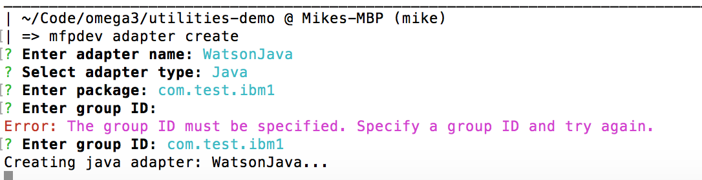

# Adding Watson Speech To Text

## 1. Introduction

In this guide, we will add the Watson [Speech To Text](http://www.ibm.com/watson/developercloud/doc/speech-to-text/) service to our MobileFoundation application. IBM's Watson is the leading cognitive computing platform and provides a vast number of easy to use API's to access the artificial intelligence engine, allowing anybody to get started quickly and for free. There are a number of ways to integrate Watson services into your architecture, such as using a variety of Watson Developer Cloud SDKs or the individual Watson service's REST APIs. All of these methods have their own corresponding documentation and labs available from multiple sources. There are also a number of cognitive services that Watson provides - you can browse all of them at the [Bluemix catelog]
(https://console.ng.bluemix.net/catalog/?taxonomyNavigation=watson&category=watson).

## 2. Why use Watson Speech-to-Text?

We chose to use the Watson speech-to-text service in this demo application to help the user quickly fill out a form. In this example, the application user records a voice message, which is then sent off to Watson, transcribed to text, and added to the form. The data could then easily be mined for specific keywords that correspond to specific form fields.

You may be wondering why we are using Speech-to-Text when all of the major mobile operating systems have a built in voice functionality. We chose to use Watson instead of the built in speech-to-text for two reasons:

1. When using the Android/iOS speech-to-text, the voice data is transcribed by Google or Apple services, respectively. This is sometimes not acceptable if your business deals with sensitive information that should not be stored on a third party cloud. Even if the data is transcribed by the device and not by a cloud service, it is still not accessible to you, the app developer - you cannot delete the data and guarantee that it cannot be accessed by others.

2. With Watson, we have the ability to do further processing on the audio data. You will see in this example that we take the transcribed data from Watson, scan for key words (form field names), and fill out the form appropriately. With the built in speech functionality, you do not have the ability to manipulate the transcribed data before it gets sent to your application. Another example of manipulating the data first would be to transcribe an audio file from one audio format to another before sending to Watson.

Finally, this guide will show you how to send a large data file using MobileFoundation Platform and the adapter technology. This could be altered a bit to send an image file and use Watson Visual Recognition services, or any other Cognitive services provided by Watson.

## 3. Architecture
There are many different possible architectures that we could have used to integrate Watson services. We chose to record an audio file with the device and send that audio file to our Mobile Foundation server. There we save the audio file on the server and then send the file to Watson using the Watson Developer Cloud SDK. This gives us a chance to manipulate the audio file on our server if we need to - for example, you might need to further process the data or convert it to a different audio format that is accepted by Watson.

Another benefit of using the adapter functionality of Mobile Foundation was that it comes with built in security that is easy to configure. This is *essential* when using Watson services so that people cannot use your Watson service (that you pay for!) without your knowledge. It is true that Watson provides a credential mechanism that you can use to make a secure connection to the service, but using an adapter provides additional benefits, like using analytics to see how often your Watson endpoint is hit.

## 4. Setting up Watson STT service on Bluemix
The first thing we want to do is set up the Watson Speech to Text service on Bluemix.

Navigate to your *Bluemix catalog*, search for *Watson Speech to Text*, and pick the *Standard* version. Provision it to the same space that you are building this application in. You will be able to retrieve the username and password from your VCAP variables or from the "Credentials" tab when viewing the service on Bluemix dashboard. (Note, Watson provides the ability to request an [API Access Token](http://www.ibm.com/watson/developercloud/doc/getting_started/gs-credentials.shtml) that you can use to make requests to the service without having to hard-code your username/password in the request. This is currently beyond the scope of this demo but is not difficult to implement.)


Once you have provisioned the Speech To Text service, you can test it out by sending audio files to the service using cURL. There are plenty of examples of this on the Speech to Text documentation. An example cURL request looks like this:

```curl -X POST -u "username":"password" --header "Content-Type: audio/wav" --data-binary @audio.wav "https://stream.watsonplatform.net/speech-to-text/api/v1/recognize?max_alternatives=3&word_confidence=true"```

That's it, we have successfully provisioned and tested an instance of the Watson Speech to Text service.

### 3. Building the Watson STT Adapter
We need to build a new [MobileFirst Adapter](https://mobilefirstplatform.ibmcloud.com/tutorials/en/foundation/8.0/adapters/) to receive an audio file and then send it to our Watson service. Our adapter is simple and will just write a temporary audio file to the system and then use the [Watson Developer SDK for Java](www.ibm.com/watson/developercloud/speech-to-text/api/v1/?java#recognize_sessionless_nonmp12) to recognize the audio in this file. This means that we will just have to wait while the system transcribes the data - if you read through the API, you will see that there are *session-based* architectures available that will provide more benefits, like "live" audio transcription. 

We will be building a [Java HTTP Adapter](https://mobilefirstplatform.ibmcloud.com/tutorials/en/foundation/8.0/adapters/java-adapters/java-http-adapter/) for this because it turns out to be the easiest for dealing with audio files, especially if we wanted to add in further processing to the audio file on the server side. Watson does provide a Node SDK that could be used in a JavaScript adapter, if you so choose. *Bonus:* Our adapter also includes a [custom request filter and interceptor](https://jersey.java.net/documentation/latest/filters-and-interceptors.html) to log the HEADERS of all requests coming into our adapter. This is extremely useful when developing and debugging adapters. 

If you have checked out the project from the Github repo, you can simply navigate to the */adapters/WatsonJava/* folder and run `mfpdev adapter build && mfpdev adapter deploy`, but it is more fun to create it from scratch. Navigate to your *adapters/* folder and type `mfpdev adapter create` - follow the prompts to create a Java adapter:


### Add WatsonSDK to your Adapter's pom.xml
Open up the `pom.xml` file for your adapter. Here you can declare other dependencies from Maven that will be used in your Java project. Add the following dependencies, which will allow us to use Watson and some other libraries used for the request filter.
```
<dependency>
  			<groupId>com.ibm.watson.developer_cloud</groupId>
  			<artifactId>java-wrapper</artifactId>
  			<version>RELEASE</version>
  		</dependency>
  		<dependency>
  			<groupId>commons-io</groupId>
  			<artifactId>commons-io</artifactId>
  			<version>2.4</version>
  		</dependency>
  		<dependency>
  			<groupId>com.ibm.watson.developer_cloud</groupId>
  			<artifactId>java-sdk</artifactId>
  			<version>2.9.0</version>
  		</dependency>
  		  <dependency>
          <groupId>javax.json</groupId>
          <artifactId>javax.json-api</artifactId>
          <version>1.0</version>
      </dependency>
    <dependency>
        <groupId>javax.xml.bind</groupId>
        <artifactId>jaxb-api</artifactId>
        <version>2.2.12</version>
    </dependency>
  <dependency>
        <groupId>org.glassfish</groupId>
        <artifactId>javax.json</artifactId>
        <version>1.0.4</version>
      </dependency>
    <dependency>
    <groupId>org.glassfish.jersey.media</groupId>
    <artifactId>jersey-media-multipart</artifactId>
    <version>2.17</version>
</dependency>
      <dependency>
          <groupId>com.squareup.okhttp3</groupId>
          <artifactId>okhttp</artifactId>
          <version>3.4.1</version>
      </dependency>
```

#### Add the adapter code
Open up your *WatsonJavaResource.java* file and add the following code to create our endpoint:
 ```
 @Logged
  @POST
  @OAuthSecurity(enabled = false)
  @Path("/uploadBase64Wav")
  public Response handleUpload(@FormParam("audioFile") String base64wav, @QueryParam("keywords") String keywords, @Context HttpHeaders headers) throws Exception {

      // Convert the base64 string back into a wav file
      // http://stackoverflow.com/questions/23979842/convert-base64-string-to-image
      String base64 = base64wav.split(",")[1]; // remove the "data:audio/x-wav;base64" header
      byte[] wavBytes = javax.xml.bind.DatatypeConverter.parseBase64Binary(base64);
      System.out.println("bytes:" + wavBytes);
      System.out.println("Keywords:" + keywords);
      return callWatson(wavBytes, keywords);
  }
```

Look at the method signature. We will be accepting the audio file as a *base64 encoded string* as a FormParamater named *audioFile*. We are also accepting a query param named *keywords* which will be used to send specific keywords that Watson can identify - these would be the form paramaters that we want to automatically fill in. Also, note the custom `@Logged` annotation which will invoke our special receiver and print out all the meta data of any request that comes in. *Important:* we need to remove the header string that appears in the audio file so that Watson will recognize it. Otherwise, we might get errors from Watson like "unable to transcode data stream audio/wav -> audio/x-float-array".

Now, add the *callWatson()* method, which will save the base64 data as a *.wav* file and send this to Watson. 

```
    // Receive audio file byte[], write a temp file that we send to Watson
    // Return an HTTP response with the transcript
    private Response callWatson(byte [] body, String keywords){

      SpeechToText service = new SpeechToText();

      // Get our username/password for Watson from the Adapter configuration api
      // See the MobileFirst docs. Be sure to set these values in your mfp dashboard
      service.setUsernameAndPassword(configApi.getPropertyValue("Username"), configApi.getPropertyValue("Password"));
      service.setEndPoint("https://stream.watsonplatform.net/speech-to-text/api");

      String[] arr = keywords.split(",");
      logger.warning("Keyword array:" + arr.toString());
      // having a lot of trouble with Keywords and sessionless recognize() method
      // for now, we won't be using keywords
         // Save the audio byte[] to a wav file
        String result = "";
        File soundFile = null;
        try {
            // this isn't quite working, seems like we can send a blank file
            logger.warning("Have speech file, creating temp file to send to Watson");
            logger.warning("Using these keywords:" + keywords);
            soundFile = File.createTempFile("voice", ".wav");
            FileUtils.writeByteArrayToFile(soundFile, body);
        } catch (IOException e) {
            logger.warning("No audio file received");
            e.printStackTrace();
            return Response.status(400).entity("No audio file received").build();
        }

        // Transcribe the wav file using Watson's recognize() API
        try {

          if( soundFile.exists()){
            logger.warning("Sound file exists!");
            List<Transcript> transcripts= service.recognize(soundFile, "audio/wav").getResults();

              logger.warning("Got some results!");
              for (Transcript transcript : transcripts) {
                  for (SpeechAlternative alternative : transcript.getAlternatives()) {
                      result = alternative.getTranscript() + " ";
                      logger.warning("result:" + result);
                  }
              }
              return Response.ok().entity(result).build();
          }else{
            logger.warning("----- SOUND FILE NOT FOUND, bluemix can't save file");
            return Response.status(400).entity("Sound file could not be saved to server").build();
          }
        } catch (com.ibm.watson.developer_cloud.service.BadRequestException bre){
          logger.warning("com.ibm.watson.developer_cloud.service.BadRequestException");
          logger.warning(bre.getStatusCode() + bre.getMessage() + " \n");
          return Response.status(400).entity(bre.getMessage()).build();
        } catch (Exception e){
          logger.warning("No transcript from service! Some warning!" + e.getMessage());
          e.printStackTrace();
          logger.warning("----- good luck ----");
          //logger.warning(e.getResponse().toString() + "\n");
          return Response.status(400).entity(e.getMessage()).build();
        }
    }
 ```

Finally, copy over the *Logged.java* and *RequestLoggingFilter.java* from the repo if you want to use the `@Logged` annotation. 

#### Building and deploying the adapter
Before we can deploy the adapter, we need to add the following two lines to our `adapter.xml` file:
```
	<property name="Username" defaultValue=""/>
	<property name="Password" defaultValue=""/>
```
Then, build the adapter: `mfpdev adapter build`. You will now have to deploy it manually by navigating to your MobileFirst console and clicking the "Deploy new Adapter" under *Actions* menu. 


### 6. Updating the Utilities application
We will now update our Ionic application to allow it to record an audio file. The comments in the `report-equipment.js` file will walk you through the necessary changes to create a file on the device, initialize the audio recorder, and then upload the audio file to our MFP adapter. We also have to make some changes to `reportEquipment.html` file, such as adding the recorder buttons. Finally, because we are using some additional third party Cordova plugins and the [ngCordova](http://ngcordova.com/) module, we will need to run a few `ionic` CLI commands to install these plugins.

Perhaps the most difficult part of using Watson to transcribe an audio file is actually sending the audio file through MobileFoundation adapters. We need to convert the audio file into a *base64* data string that we can then send to the service as a form parameters. Look carefully at the documentation and StackOverflow questions for Mobile Foundation adapters if you get stuck.

First, we need to create a file on the device:
```
 $ionicPlatform.ready(function(){

        //window.requestFileSystem(window.TEMPORARY, 5 * 1024 * 1024, function (fs) {
       // persistant definitly works! We are having problems with TEMPORARY
        window.requestFileSystem(LocalFileSystem.PERSISTENT, 5*1024*1024, function (fs) {

            // Create a .wav file, which is accepted by Watson API and is also the
            // default recording format for iOS when using the MediaCapture plugin
            // For Android, MediaCapture records in .3ggp and some other formats
            // so we will use a third-party recorder to record in .wav format
            // Alternatively, we could transcode the audio format on the adapter
            var f = "watsonSTT-"+Date.now()+".wav";
            createFile(fs.root, f, false);

          },function(err){
            console.log("Error opening file system: " + JSON.stringify(err));
          });
      },false);
    };
```

Next, once the file has been created, we need to get the file location and initialize our audio recorder with that location. You will note here that we are using Cordova's ability to distinguish between platforms in order to create a different audio recorder object on Android and iOS. The reason for this is that we want to use a thrid party Cordova plugin for Android audio recording: [ro.martinescu.audio](https://github.com/petrica/wav-recorder)  This plugin will record the audio file in a *.wav* format on Android, which is different than the default *oog* format. Watson *Speech to Text* service has requirements on the [types of audio formats](https://www.ibm.com/watson/developercloud/doc/speech-to-text/input.shtml#formats) it can transcribe. iOS, by default, records in *.wav* format, so we chose to use a plugin to record in Android in .wav format as well and avoid having to transcode the audio files on the server to the same format. This isn't stricly necessary - instead of using a cordova plugin, we could have just created additional endpoints on the Java side of our adapter. 
```
 // Creates a new file or returns the file if it already exists.
  function createFile(dirEntry, fileName, isAppend) {
      dirEntry.getFile(fileName, {create: true, exclusive: false}, function(fileEntry) {
          // For Android, we need to set up the third party wav-recorder plugin
          // from here: https://github.com/petrica/wav-recorder
          // For iOS, we need to set up Cordova MediaCapture plugin
          $scope.audioFile = fileEntry.toURL();
          try{
          if( $ionicPlatform.is("Android")){
            $scope.recorder = new martinescu.Recorder($scope.audioFile , { sampleRate: 22050 }, recorderStatusChangeCallback, bufferCallback);
          }else{
            // Need to "stub out" the wav recorder functionality here with the MediaCapture API
            // These are the only recoder() methods we use
            $scope.recorder = {};
            $scope.recorder.release = {};
          }
        }catch(e){alert(e)};

          return fileEntry.toInternalURL(); //fullPath;//fileEntry
      }, function(createFileError){
        console.log("Error creating a file" + JSON.stringify(createFileError));
      });
  };
```

The Android recorder will call *recorderStatusChangeCallback()* when the internal state machine changes. This happens when you start recording, stop recording, etc. (see the documentation on the plugin.) We decided to use this status change and a simple `alert()` to control when the app is actually recording or not. This is not necessary for iOS, since the [cordova-plugin-media-capture]((https://github.com/apache/cordova-plugin-media-capture) plugin creates a simple user interface for iOS.

```
  var recorderStatusChangeCallback = function (mediaStatus, error) {

    if (martinescu.Recorder.STATUS_ERROR == mediaStatus) {
      alert("Error recording, please release recorder and try again." + JSON.stringify(error));
      console.log("Error recording, please release recorder and try again." + JSON.stringify(error))
    }else{

      if(mediaStatus == martinescu.Recorder.STATUS_READY){
        // When we call the record() meethod on the Recorder, the state will be
        // STATUS_READY at first, so we can use this to code block to give them an
        // instructional popup if we want. If they have hit record() the recorder
        // will already be recording in this state, so don't let them read too much!
        var t = 'Recording Now! Say these keywords:\n\n';
        t += keywords.toString().replace(/,/g, "\n\n");
        t+='\n\nHit STOP to save and uplaod!';

        var alertPopup = $ionicPopup.alert({
    			title: 'Recording now!',
    			template: t
    		});
    		alertPopup.then(function(res) {
            $scope.recorder.stop();
        });

      }else if(mediaStatus == martinescu.Recorder.STATUS_STOPPED){
        console.log("Recorder has stopped! Auto uploading now...");
        uploadToAdapter($scope.audioFile);
      }
    }
  }
```

Next, add the *record()* method. Here, again, we have to do something slightly different, depending on what platform we are on:
```
  // This method may need to do something different for iOS record()
  // which is why it is a method instead of just calling $scope.record() from HTML
  $scope.record = function(){

    if( $ionicPlatform.is("Android")){
        $scope.recorder.record();
    }else{
      //var d = 60*5;
      var options = { limit: 1};//, duration: d }  // 5 minutes max
     $cordovaCapture.captureAudio(options).then(function(audioData) {
       // Success! Audio data is here
       uploadToAdapter(audioData[0].localURL);

     }, function(err) {
       alert("Error occured recording from iOS:" + err);
     });

   }//if ios
  }
```

Finally, we need to add the *upload()* method that will actually upload the audio file to our adapter. To do this, we are going to use the [*sendFormParameters()*](https://mobilefirstplatform.ibmcloud.com/tutorials/en/foundation/8.0/application-development/resource-request/javascript/#sendformparameters-json) method of the *WLResourceRequest* API.  The most important part of this method is that we are also using the [*FileReader.readAsDataURL()*](https://developer.mozilla.org/en-US/docs/Web/API/FileReader/readAsDataURL) API to read the audio file as a base64 encoded string, which is required when using MFP adapters. **Note:** You cannot upload the data file to an adapter with [cordova-file-transfer](https://cordova.apache.org/docs/en/latest/reference/cordova-plugin-file-transfer/), an AJAX post, or any other method - you can only do this by sending the base64 string:

```
function uploadToAdapter(path){
      // This method uses WL.client to send the audio file directly to our Java adapter
      console.log("uploading to adapter, path:" + path);
      $scope.show();  // Show the loading dialog
      // We need to get the acutal File object and convert it to a base64 string
      // which we can then send as a Form paramater to our MFP adapter
      window.resolveLocalFileSystemURL(path, function(fileEntry) {
              console.log(fileEntry);
              console.log(JSON.stringify(fileEntry));

             fileEntry.file(function(fileObj) {
                 console.log("Size = " + fileObj.size);
                try{
                   // We need to convert the file to a base64 string to send with the
                   // sendFormParameters API() in MobileFirst
                   var reader = new FileReader();
                   var req = new WLResourceRequest('/adapters/WatsonJava/uploadBase64Wav', WLResourceRequest.POST);
                  // http://stackoverflow.com/questions/16964260/phonegap-readasdataurl
                   reader.readAsDataURL(fileObj);

                   reader.onloadend = function(){
                       var data = reader.result;
                        var params = {};
                        params.audioFile = data; // 'audioFile' is the Form paramater in the JAXRS @FORM paramater

                        //Attach the Keywords as query paramaters
                        req.setQueryParameter("keywords", keywords);

                        req.sendFormParameters(params).then(function (response) {
                               $scope.hide();
                               alert("Transcript from Watson received. The entire transcript will be saved in Comments section.");
                               parseWatsonResponse(response);
                        },function(e){
                               console.log(JSON.stringify(e));
                               alert("No recording could be parsed by Watson, please try again");
                        });
                  }// reader onloadend

                 }catch(e){console.log(e)}


          });//fileENtry
      });//resolveLocalFileSystemURL
  }
```

The only other thing we need to do is add in all of our plugins:
```
ionic plugin add cordova-plugin-filepath
ionic plugin add https://github.com/petrica/wav-recorder.git
ionic plugin add cordova-plugin-media-capture
```
As well as run:
`bower install ngCordova` to install the ngCordova module. 

#### Congragulations!
Thats it! You should be able to piece together the rest of the application, such as adding any missing callbacks. In this lab we have successfully used Cordova to create a hybrid application that records audio files, converts them to a base64 string, sends them to a Java adapter, which then gets a transcription from Watson and returns that transcript to the app. We can use this functionality to drastically simplify filling out a form on a mobile device, and in this lab that was shown in the context of a utilitiy inspector. Make sure to view the entire lab series on Github.


### 7. Testing and Troubleshooting
If you are unable to use the microphone to record audio and send it to Watson, there are a few different places that you need to check. You should first enable the debugger on the device and verify that you are successfully recording audio files. You can use a file browser application to verify that the audio file is being created and saved on the device correctly. You should be able to use a media application to play back this recorded file, since it is saved in the `PERSISTENT` Cordova file location, it should be accessible by other applications. You can also search for the `bufferCallback` function and uncomment it to verify that audio is actually being recorded (on Android only.)

Once you know that the audio file is being created and recorded successfully, you should make sure there are no errors in the device debugger when it comes to uploading the actual file. Make sure that the URL that you are uploading to correctly points to your node passthrough server, and make sure that you can actually make network connections (use the browser to navigate to the passthrough server.)

After that, if you are still having problems, you can run `cf logs {nodeApName} --recent` to view the logs from your passthrough server and verify that it is receiving the audio file and sending it to Watson. Verify your Watson Speech to Text username/password. You can navigate to the passthrough server on a browser and use the simple HTML form to upload an audio file from your browser. Also, take a look at the `keywords_threshold` value in the node app. You may need to change this value depending on how "clearly" the audio sample was recorded.

### 8. Next Steps
There are a variety of "next steps" that one can take to extend this lab to make it more useful and production ready. We leave these as exercises for the reader or for potential updates to this lab.
  1. Parse the Watson transcript for keyword data and fill in only those fields on the form
  1. Augmenting the utilities application with additional Watson services, such as Visual Recognition
  5. Handle multiple audio files
  6. Handle audio files only when connected to Wifi

### 9. Lessons Learned
Over the course of developing this lab, we learned quite a bit about mobile development with Ionic, using Watson services, and using Mobile Foundation. These lessons are included in our Labs section on Github, but some major lessons are:
  1. Hybrid app development is hard, even with major improvements over the years to tooling and SDKs. Make sure you test in devices and simulators/emulators.
  2. Watson SDKs are always changing and the APIs can sometimes be a moving target. We had to pivot on this demo because the Watson service we originally wanted to show, text extraction from images, was temporarily removed from the catelog.
