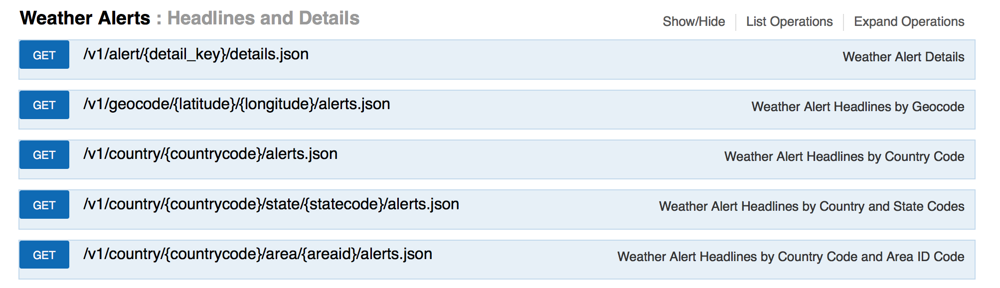
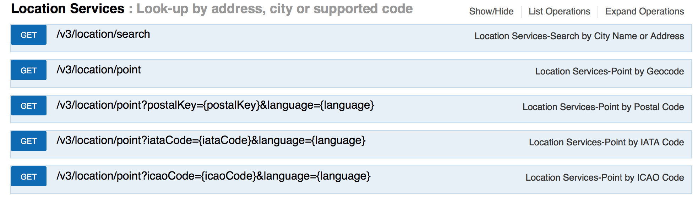

# Working with Weather Company Data

One of the features of the Utilities demo app is the inclusion of alerts when there is inclement weather near a work order. This relies on the Weather Company Data api on Bluemix to provide the alerts.

Since we will focus on incorporating Weather Company Data with the existing Cloudant adapter this lab assumes that the reader has followed all the steps from the [Cloudant](Creating a Cloudant Adapter.md) lab.

## Viewing the API

For our app we want to focus on getting alerts for inclement weather at the site of a work order. In our [Cloudant](Creating a Cloudant Adapter.md) lab we designed a location document for each work order, so that is all the location information we'll have access to. This means we can search for weather based on the street name and number, city, state, and zip code. With that in mind, let's see what Weather Company Data has to offer.

### Swagger

The best place to start is the api reference that is available [here](https://twcservice.mybluemix.net/rest-api/). Right away we can see that there are several sections, one of which is fortunately titled `Weather Alerts`.

There are 5 options here:

1. alert details
2. latitude and longitude
3. country code
4. state code
5. area id

Diving into each one narrows down our choices. **Alert details** only gives us more information about a specific alert, so that doesn't help. **Country code** gives us all the alerts in a country, but that's too broad for a single work order. **State code** gives us all the alerts for a state, which is still too broad.

That leaves us with **area id** and **latitude and longitude**. Unfortunately we don't have either of those in our work order weather document, but the Weather Company Data api also has a section titled `Location Services`, which may be able to help.

Again we have 5 options for work with:

1. search
2. point
3. postal key
4. iata code
5. icao code

Let's narrow them down. **Point** takes in a latitude and longitude, which we still don't have. Both **IATA code** and **ICAO code** take in data we don't have. Our best options are search, which can take in a city or address and postal key which can take a zip code.

Testing the output for each query (through swagger) we can see that neither option seems to return an area id. This means that we'll have to search for weather alerts based on latitude and longitude. With that in mind, **postal key** seems like the obvious choice. It returns a single latitude and longitude, whereas **search** returns multiple coordinates, which would make it much more complicated.

## Designing the adapter

### Handling limitations

There is a fundamental drawback with only using free services on Bluemix: the limits. The free version of the Weather Company Data service only allows us to call the api 10 times a minute. Unfortunately, to get an alert for a work order requires two calls, one to geocode the zip code and one to query for alerts at those coordinates. However, finding a way around this only requires that we think about what we want to do in the context of these limits and what tools we have.

The easiest way to cut down on our api calls is to 

## Writing the code

CODE GOES HERE